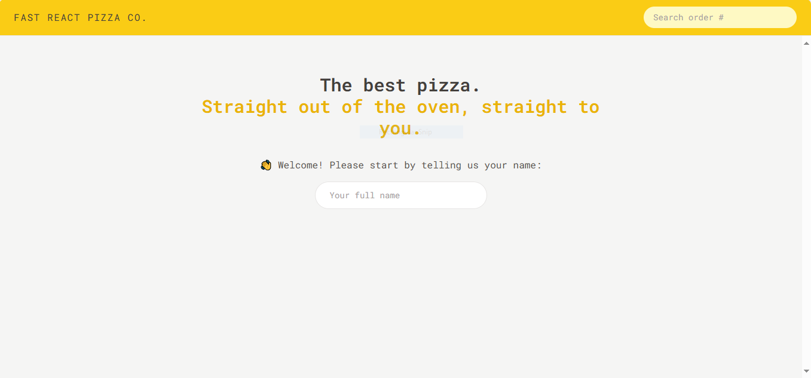
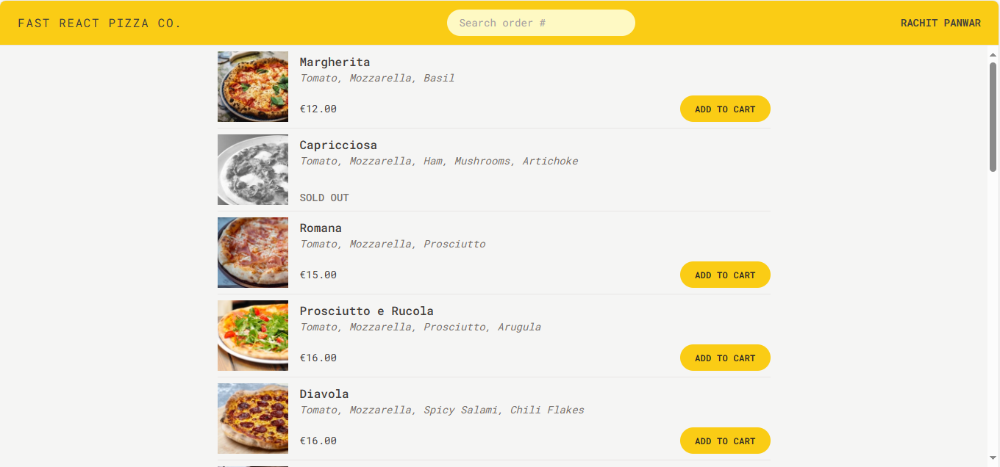

# 🍕 Fast React Pizza - Order Your Pizza Online! 🚀  

A modern **Pizza Ordering Web App** where users can:  
✅ Browse a list of delicious pizzas 🍕  
✅ Add pizzas to the cart 🛒  
✅ Choose a **priority order** to get their pizza faster ⏩  
✅ Enter their **name, phone number, and delivery address** 📞🏠  
✅ Use **current location detection** for quick address input 📍  

---

## 🚀 Features  
✔️ **Pizza Menu** – Displays a list of available pizzas  
✔️ **Cart System** – Add/remove pizzas before checkout  
✔️ **Priority Order** – Pay extra to get faster delivery  
✔️ **Location Detection** – Autofill address using current location  
✔️ **Modern UI** – Built with React & TailwindCSS  

---

## 🛠️ Tech Stack  
- **Frontend:** React, Redux, Tailwind CSS  
- **State Management:** Redux Toolkit  
- **Geolocation API:** Used to detect user location  

---

## 📷 Screenshots  
### 🏠 Homepage  
  

### 🛒 Cart Page  
  

### 📋 Order Form  
  

### 🚚 Delivery Page  
  

### 🍕 Pizza List  
  

---

## 💻 Installation  
Follow these steps to set up the project locally:  

1️⃣ **Clone the repository**  
   ```sh
   git clone https://github.com/rachitpp/fast-react-pizza.git
